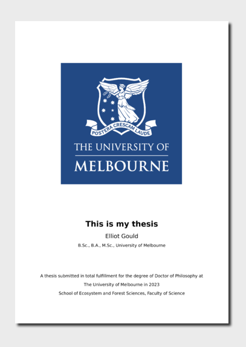

<!-- README.md is generated from README.qmd. Please edit that file -->

# University of Exeter Thesis Template

This repository is for my master dissertation project, in partial
fulfilment for the requirements of [MSc Applied Data Science (Ecology
and
Evolution)](https://www.exeter.ac.uk/study/postgraduate/courses/mathematics/appdataeco/)
at [University of Exeter](https://www.exeter.ac.uk/).

Thanks to Elliot Gould for the template [University of Melbourne Thesis
Template](https://github.com/egouldo/quarto-thesis).

